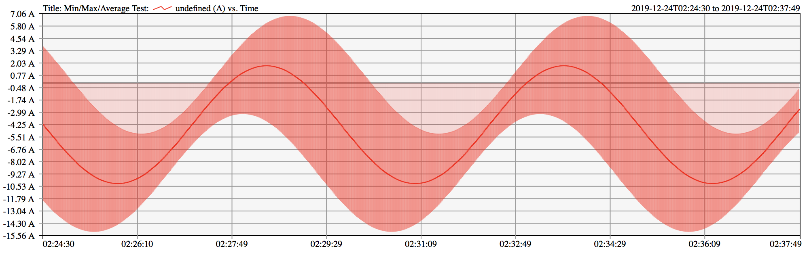

SVG Charts
==========

![license][license-img] ![github][github-img]

Simple charts using SVG

Core functionality includes:

* Multiple series
* Min/Max/Average series
* Gradient series
* Regions of indeterminacy
* Variable sample durations

Example:

See the tests for more examples: https://dslik.github.io/svg-chart/mmatests.html

An example of how to generate charts from Prometheus is also provided.

Note: This code has only been tested with Safari and Firefox. Bugs may exist when used in other browsers.

Gradients contained in the "rgb" directory are copyright Peter Kovesi, licensed under CC-BY-4.0.

[Good Colour Maps: How to Design Them. arXiv:1509.03700 [cs.GR] 2015](https://peterkovesi.com/projects/colourmaps/)

[license-img]: http://img.shields.io/badge/license-BSD-a0a060.svg?style=flat-square
[github-img]: https://img.shields.io/badge/github-dslik%2Fsvg--chart-a0a060.svg?style=flat-square